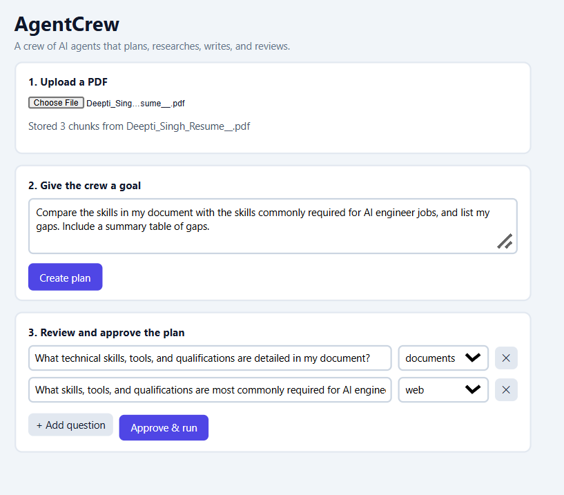
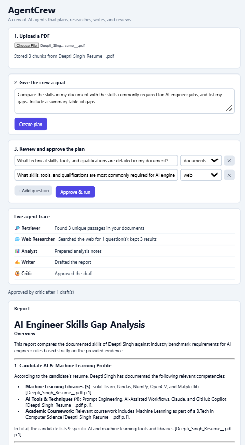
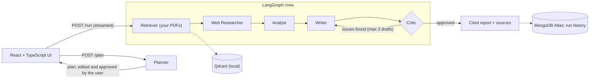

# AgentCrew

A multi-agent research and report generator. You upload a PDF, state a goal, review the plan, and a crew of AI agents retrieves evidence from your documents and the web, analyzes it, writes a cited report, and reviews its own draft before returning it.

Built with FastAPI, LangGraph, Gemini, Qdrant, React + TypeScript, and MongoDB Atlas.




## How it works



| Agent | Job |
|---|---|
| Planner | Splits the goal into 2 to 4 questions and tags each as `docs` or `web`. The user edits and approves the plan before anything runs. |
| Retriever | Semantic search over uploaded PDFs, with duplicate chunks removed. |
| Web Researcher | Free web search for questions the documents can't answer. |
| Analyst | Turns raw evidence into findings, comparisons, and gaps. |
| Writer | Writes the report using only the evidence, with citations like `[file p.1]` or `[web: example.com]`. |
| Critic | Checks every claim against the evidence and sends the draft back with a list of issues, up to 3 drafts. |

Progress streams to the UI as each agent finishes (Server-Sent Events), so you can watch the crew work.

## Features

- Cited answers, and an explicit "not found" instead of guessing when the documents don't contain the answer
- Human-in-the-loop plan approval, with editable questions and a per-question source (documents or web)
- Live agent trace and a sources panel with the retrieved passages
- Re-uploading a file replaces its old chunks (no duplicates)
- Run history in MongoDB Atlas, with past reports reopened from the UI
- Reliability: model fallback list with backoff, a cap of 12 model calls per run, input validation, a 10 MB PDF-only upload limit

## Tech stack

- **Backend:** Python, FastAPI, LangGraph
- **LLM:** Google Gemini (free tier), with fallback models
- **Embeddings:** `BAAI/bge-small-en-v1.5` via fastembed (runs locally)
- **Vector store:** Qdrant (local mode)
- **History:** MongoDB Atlas (optional)
- **Web search:** `ddgs`
- **Frontend:** React, TypeScript, Vite, react-markdown

## Run it locally

Requires Python 3.11+ and Node 20+.

```bash
git clone https://github.com/DeeptiSingh1512/agentcrew.git
cd agentcrew
```

Create `.env` from the template and fill in your values:

```
GEMINI_API_KEY=your-key                # free key from aistudio.google.com/apikey
GEMINI_MODEL=gemini-flash-latest       # any available Gemini Flash model name
MONGO_URL=                             # optional: MongoDB Atlas connection string for run history
QDRANT_PATH=./data/qdrant
```

Backend:

```bash
cd backend
python -m venv .venv
.venv\Scripts\activate        # macOS/Linux: source .venv/bin/activate
pip install -r requirements.txt
python -m uvicorn app.main:app --port 8000
```

Frontend (second terminal):

```bash
cd frontend
npm install
npm run dev
```

Open http://localhost:5173, upload a PDF, enter a goal, review the plan, and run the crew.

The first upload downloads a small embedding model (about 130 MB). If a Gemini model name gets retired, set `GEMINI_MODEL` in `.env` to another Flash model.

## API

| Method | Path | Purpose |
|---|---|---|
| POST | `/upload` | Upload a PDF (ingest, chunk, embed, store) |
| POST | `/ask` | Single-shot cited RAG answer |
| POST | `/plan` | Create a plan for a goal |
| POST | `/run` | Run the crew on an approved plan (streamed) |
| GET | `/history`, `/history/{id}` | List and reopen saved runs |
| GET | `/health` | Health check |

## Evaluation

`eval/run_eval.py` asks the same 14 questions to a single agent (one retrieval and one model call) and to the full crew, then compares them. Ten questions are answerable from the uploaded resume, and four are unanswerable (including a false-premise question), to test refusals.

| Mode | Answer accuracy | Correct refusals | Citation rate | Avg seconds | Avg model calls |
|---|---|---|---|---|---|
| Single agent | 100% | 100% | 100% | 34.6 | 1.0 |
| AgentCrew | 100% | 100% | 100% | 130.9 | 3.3 |

**What this shows:** on simple single-fact lookups over a short document, both designs are equally accurate, and the crew costs about 3x more model calls and takes about 4x longer. I do not claim the crew is more accurate here. The extra steps (analysis and review) are meant for multi-part and multi-source goals, where the Critic caught unsupported claims and bad citations during manual runs. A proper test of that is future work.

Run it yourself (stop the backend first, because local Qdrant allows one process):

```bash
python eval/run_eval.py
```

## Known limitations

- One shared document store and no authentication (a single-user demo)
- Local Qdrant allows only one process at a time
- Fixed-size character chunking can cut sentences in half
- The evaluation is small: one document, 14 questions, keyword-based scoring
- The Critic uses the same model as the Writer, so they can share blind spots
- Free Gemini tiers can return rate-limit or overload errors, which the retry logic softens but doesn't remove
- Web search results are not verified for quality

## Project structure

```
backend/app/    FastAPI app, agents (LangGraph), tools, ingestion, history
frontend/       React + TypeScript UI
eval/           Evaluation questions, runner, results table
docs/           Screenshots
```